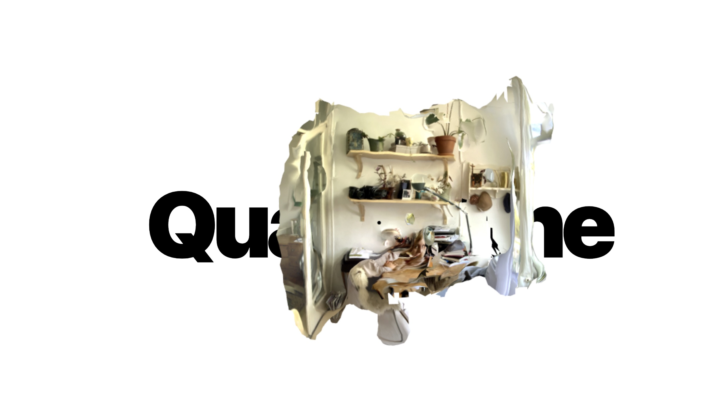
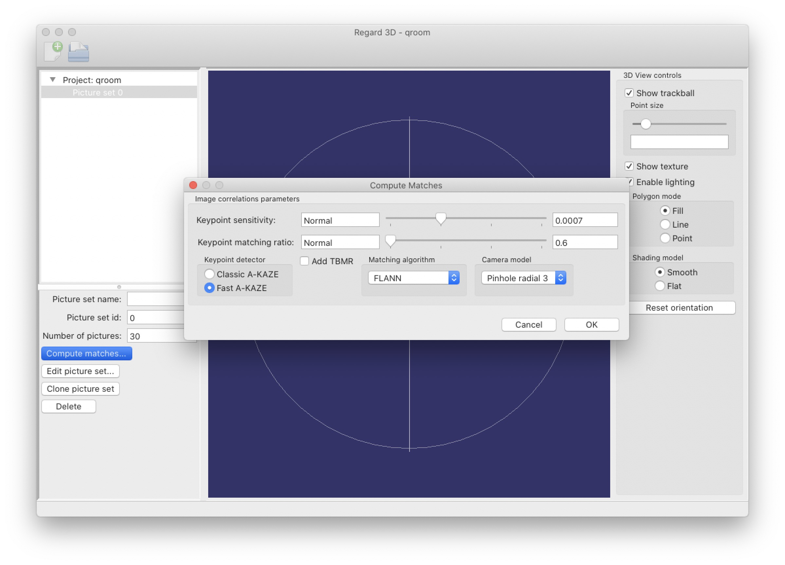
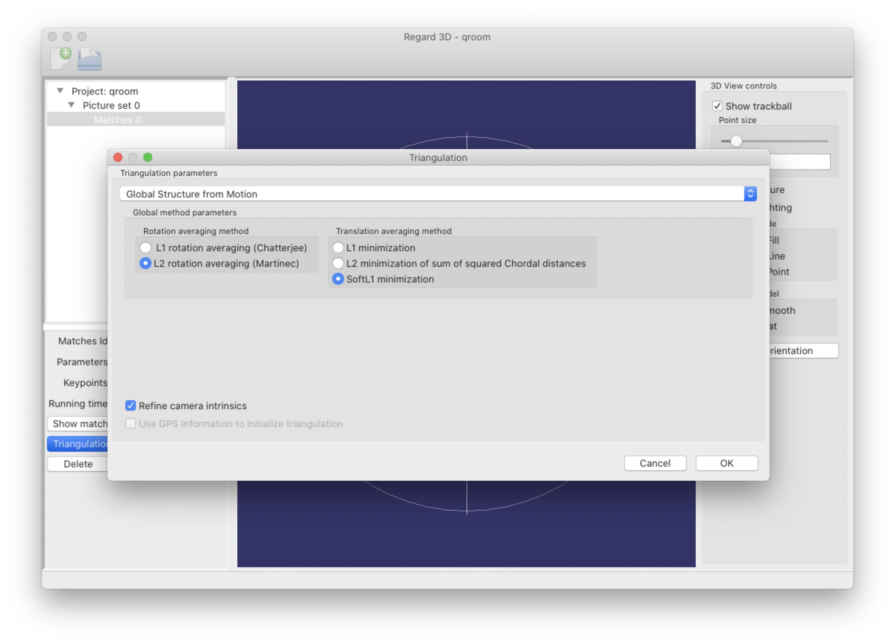
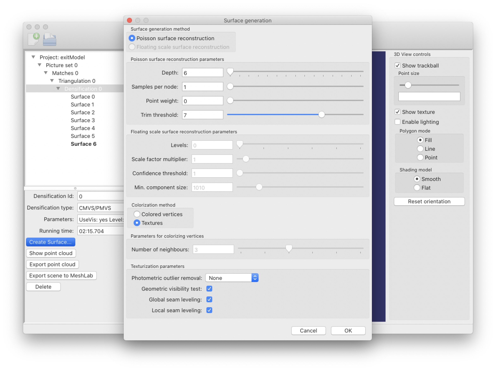

# Photogrammerty three.js Boilerplate

## Building a model in Regard3d

This should take ~40 min. Duration is highly dependent on your computers performance and the amount of images you take.

### Instructions

1. Take 20–50 pictures. When taking pictures, move by small amount around your scene. Wide angle lenses work best.
2. Download Regard3d : https://sourceforge.net/projects/regard3d/files/latest/download
3. Create a new project
4. Import your images (for some cameras, sensor width (not diagonal) and focal length needs to be set manually. If you don’t know it, you can search for it on google)
5. Please select these settings
   1. Compute Matches Stage
      
   2. Triangulation Stage
      
   3. Surface Generation Stage
      
6. Export as .obj (this generates .pngs, and obj and an mtl file)
7. Dump all files here: https://www.creators3d.com/online-viewer
8. Under optimizations, turn on image, mesh and „compress as png“.
9. Download GLB
10. Upload the .glb file here with your name in the title: https://drive.google.com/drive/folders/1xkkB2qXrySHoB-rO1nPJrzq1p-QvHMDm?usp=sharing.

### Troubleshooting

- If it takes too long to compute, try less images and/or less depth at the surface generation stage
- There’s no .mtl file: you likely forgot to check „textures“ during step 5.3.
- Contact me here: moritz.salla@hotmail.de

### Running the app

#### `yarn start`

Runs the app in the development mode. 
Open [http://localhost:3000](http://localhost:3000) to view it in the browser.

The page will reload if you make edits. 
You will also see any lint errors in the console.

#### `yarn build`

Builds the app for production to the `build` folder. 
It correctly bundles React in production mode and optimizes the build for the best performance.

The build is minified and the filenames include the hashes. 
Your app is ready to be deployed!

See the section about [deployment](https://facebook.github.io/create-react-app/docs/deployment) for more information.
